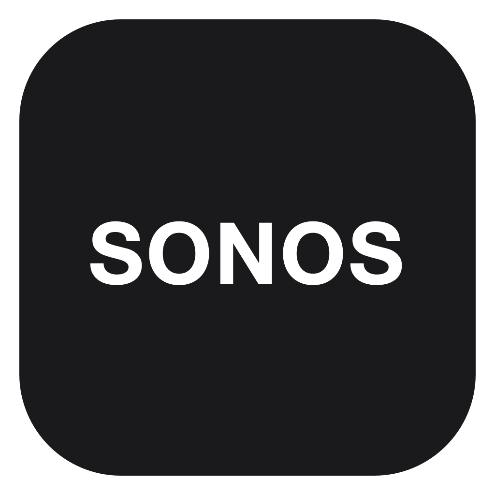

# Sonos - Chrome App

A dedicated Sonos web app for macOS with a native menu bar controller.



## Features

- An independent **Sonos** window and macOS app identity in Dock and ⌘Tab,
  using Chrome's official installed web app mechanism.
- A dedicated Chrome profile, separate from your everyday browser.
- Automatic menu bar controller startup when opening the Sonos launcher.
- Current room, song, artist and album artwork in a native popover.
- Play/pause, previous/next, group volume and mute through the Sonos LAN API.
- System light/dark appearance and the existing SONOS app and menu bar icons.
- A small button to open Sonos and another to exit the controller.
- Memory and disk caching for album artwork.

## Requirements

- macOS 13 or later. The current local application was used on Apple silicon
  with macOS 26; older macOS and Intel runtime behavior have not been verified.
- Google Chrome installed at `/Applications/Google Chrome.app`.
- Xcode Command Line Tools (`xcode-select --install`) and Python 3 for building.
- Node.js 18+ for automated web app setup; no npm packages are required.
- A Sonos system on the same local network. The controller currently discovers
  an IPv4 Sonos device using SSDP and follows that device's group coordinator.

## Build and install

```bash
git clone https://github.com/weekendli/sonos-chrome-app.git
cd sonos-chrome-app
bash scripts/build.sh
bash scripts/install.sh
node scripts/setup-web-app.mjs
```

If an existing dedicated Sonos Chrome is running, the setup script exits before
changing it. To explicitly allow that Chrome instance to restart:

```bash
node scripts/setup-web-app.mjs --restart
```

Setup installs the website's official manifest, selects `standalone` display
mode, applies the existing icon through macOS's custom icon API, closes its
temporary local debugging pipe and opens Sonos normally. It does not open a
TCP debugging port. On a new installation, sign in to Sonos in its own window.

If the menu bar controller is already running, exit it using its power button
before installing a replacement launcher. The installer backs up an existing
launcher and prints the backup path.

Build for both Apple silicon and Intel:

```bash
ARCHS="arm64 x86_64" bash scripts/build.sh
```

No signed/notarized installer is provided. Locally built application bundles
use ad hoc signatures. The GitHub workflow compiles the universal application
and uploads a build artifact; it does not publish a notarized release.

## Daily use

Open `~/Applications/Sonos.app`. It starts the embedded controller if needed
and opens the installed Sonos web app. Click the SONOS menu bar icon for the
playback card. Controls are enabled according to the speaker's available
transport actions.

The power button exits **only the controller**. Closing the Sonos window or
quitting the Sonos web app does not automatically quit the controller.
Launching the web app directly from a pinned Dock item does not run the
launcher; use the launcher when you also need to restart the controller.

Chrome remains the rendering engine, while the website window has its own
Sonos app identity. Do not move Chrome or manually edit its generated shim.
Chrome updates may regenerate its icon; rerun setup to reapply the custom icon.

## Local data and permissions

| Data | Location |
| --- | --- |
| Launcher + embedded controller | `~/Applications/Sonos.app` |
| Chrome-generated web app | `~/Applications/Chrome Apps.localized/Sonos.app` |
| Dedicated browser profile and Sonos login | `~/Library/Application Support/Sonos Chrome App` |
| Discovered device preference | `local.ops.sonos-controller` user defaults |
| Album art cache | `~/Library/Caches/local.ops.sonos-controller/AlbumArt` |
| Installer/setup log | `~/Library/Logs/Sonos Chrome App/install.log` |
| Previous launcher backups | Dedicated profile's `Backups` directory |

Allow local network access if macOS prompts. The controller does not require
Accessibility permission, browser scripting permission, or a Sonos cloud API
credential. The website handles its own login. Browser cookies and session
credentials stay in the local dedicated profile.

## Limitations

- One discovered Sonos group; no room picker yet.
- SSDP requires multicast connectivity; a VPN, guest network or network isolation
  may prevent discovery. IPv6-only discovery is not implemented.
- LAN control uses the devices' UPnP/SOAP services; it is separate from Sonos's
  authenticated cloud API and may vary with device/firmware capabilities.
- Live playback state is fetched, rather than cached. Artwork uses an 8 MB image
  cache plus a URL cache with 4 MB memory and 24 MB disk capacity. Playback state
  refreshes every second while the card is open and every three seconds otherwise.
- There is no custom cache proxy for the Sonos website, no login agent, no global
  media key integration and no automatic updater.

See [architecture](docs/architecture.md), [maintenance](docs/maintenance.md)
and [notices](NOTICE.md).
