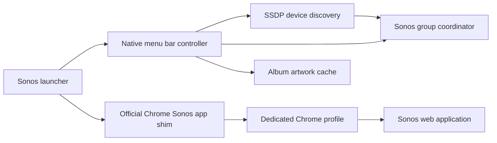

# Architecture

## App identity

The native launcher is a short-lived accessory application. The official
Chrome-generated shim owns the standalone Sonos application identity and
coordinates the website's window, Dock item and application menus with Chrome.
The controller is an embedded accessory app with a native status item and
popover. Its Open Sonos button returns to the native launcher.

The Chrome web app comes from `https://play.sonos.com/manifest.webmanifest`.
Its current manifest ID is `https://play.sonos.com/`. The launcher depends on
Chrome's generated shim at the standard per-user Chrome Apps location.

## Control path

`SonosLANClient` runs network work on a serial queue. It discovers Sonos devices
using an SSDP M-SEARCH, loads the device description and control URLs, reads zone
group topology, and directs transport/volume operations to the coordinator.
The current device description URL is kept in user defaults for faster reconnect.
Discovery retries and failed artwork downloads have backoff.

State comes from GetPositionInfo, GetTransportInfo, GetGroupVolume,
GetGroupMute and GetCurrentTransportActions. Current DIDL metadata supplies the
track, artist and artwork URL. Controls use Play/Pause, Previous/Next,
SetGroupVolume and SetGroupMute. XML parsing disables external entity resolution.

LAN control HTTP URLs are restricted to IPv4 private/link-local addresses.
Local network requests bypass system HTTP proxies. Artwork can use HTTPS or a
local HTTP URL. The UI updates asynchronously on the main thread.

## Setup

The Node setup helper uses Chrome DevTools Protocol over inherited file
handles 3 and 4. PWA.install and PWA.changeAppUserSettings are available in this
local pipe session. The pipe is closed after setup and normal startup is restored.
No cookies or page storage are exported. The icon helper uses NSWorkspace.setIcon,
leaving Chrome's generated executable and signed bundle resources unchanged.

Reference: [Chrome web apps](https://support.google.com/chrome/answer/9658361),
[Chromium macOS app mode](https://www.chromium.org/developers/design-documents/appmode-mac/),
[DevTools PWA protocol](https://chromedevtools.github.io/devtools-protocol/tot/PWA/).
